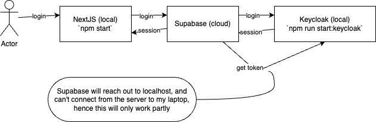

# NextJS Supabase Keycloak example

This is an example project to provide information to get NextJS/Keycloak/Supabase authentication to work. The issue description can be found in [docs/issue-description.md](./docs/issue-description.md). This repo has a docker-compose file for keycloak set up correctly, assumes you can create a project in Supabase and runs a local NextJS app to login. 

## Run locally

Prerequisites: Node 20.3.1, Docker

1. `npm i` - install dependencies
2. `npm run init` - to generate the .env file, make sure to put your supabase stuff
3. `npm run start:keycloak` - start local keycloak with pre set up realm and users
4. `npm start` - start the app locally

## Resources used

1. `npx create-next-app@latest` from https://nextjs.org/docs/pages/api-reference/create-next-app
2. set up supabase from https://supabase.com/docs/guides/auth/social-login/auth-keycloak

## More info

See [docs/README.md](./docs/README.md)

for:

- [Set up Keycloak](./docs/README.md#set-up-keycloak)
- [Set up Supabase](./docs/README.md#set-up-supabase)
